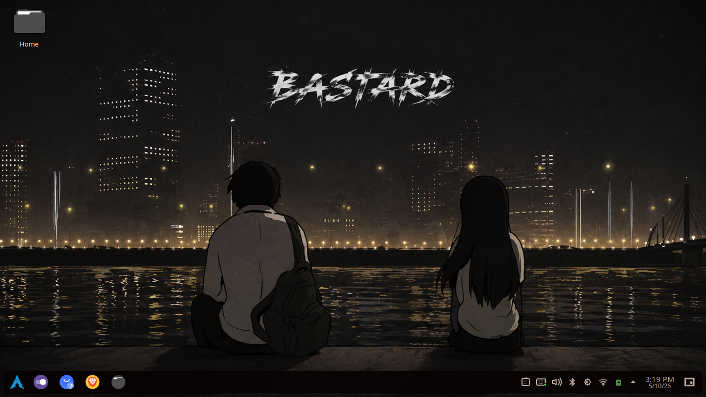

# 🍫 Anime-wp — Arch KDE Plasma Rice Kit

> A minimal, dark-themed KDE Plasma rice with anime/manhwa aesthetics, custom bar, and 4K wallpapers.

---

## Previews

### Desktop 一


### Desktop 二


---

## 📁 Repository Structure

```
anime-wp/
├── ArchRice/
│   ├── arch-linux.png        # Arch Linux wallpaper
│   ├── arch-terminal.png     # Terminal screenshot
│   ├── betterbar.png         # Custom Latte/panel bar preview
│   ├── desktop.png           # Full desktop preview
│   └── rice.txt              # Config notes / package list
├── wallpapers/               # Anime & Manhwa 4K wallpaper collection
├── colours.zip               # Colour schemes / palettes
├── fastfetch-colours.zip     # Fastfetch theme configs
└── kitty-theme-guide.md      # Guide for setting up Kitty terminal themes
```

---

## ⚙️ Setup

### Requirements

- Arch Linux (or any Arch-based distro)
- KDE Plasma 6+
- Kitty terminal
- Fastfetch

### Installation

1. **Clone the repo**
   ```bash
   git clone https://github.com/wizmax11/anime-wp.git
   cd anime-wp
   ```

2. **Apply wallpaper**
   Browse the `wallpapers/` folder and set your favourite via KDE System Settings or `feh`/`swww`.

3. **Import colour schemes**
   Extract `colours.zip` and place the `.colors` files in `~/.local/share/color-schemes/`.
   Then apply via *System Settings → Colors*.

4. **Set up Fastfetch**
   Extract `fastfetch-colours.zip` into `~/.config/fastfetch/`.
   ```bash
   fastfetch
   ```

5. **Kitty terminal theming**
   Follow the guide in [`kitty-theme-guide.md`](kitty-theme-guide.md) to apply matching terminal colours.

---

## 🖼️ Wallpapers

The `wallpapers/` folder contains a curated collection of **anime & manhwa 4K wallpapers** with a dark, moody aesthetic — perfect for a clean desktop setup.

---

## 📝 Notes

- Config details and the full package list are in `ArchRice/rice.txt`.
- All wallpapers are sourced for personal use. Please respect original artists.

---

## 🔗 More

Check out the blog post at [hiro.bearblog.dev](https://hiro.bearblog.dev/arch-linux-mini...) for a full write-up of this rice.

---

*Made with ❤️ by [wizmax11](https://github.com/wizmax11)*
